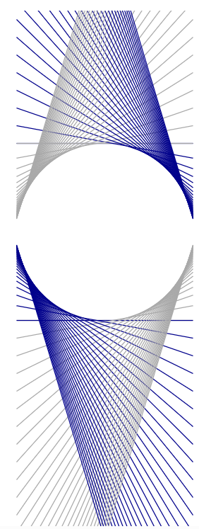
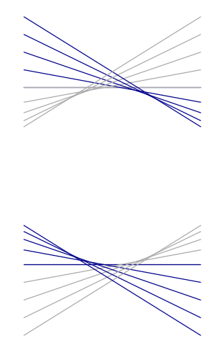
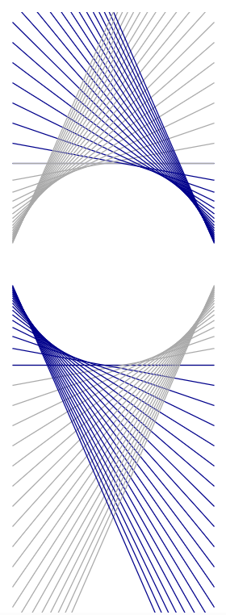

# Circulo_tangentes
Circulo a partir de tangentes - em javascript d3

Como criar um círculo apenas com retas?

Com matemática, é claro.

A construção acima é formada apenas com retas.

Imagine duas retas verticais, uma no x1 = 0 e outra no x2 = 1.

As primeiras retas horizontais ligam o y1 = 1 a y2 =1 e a mesma coisa para y1 = -1 e y2 = -1.

A ideia a seguir é ir ligando y1 = n a y2 = 1/n, e o recíproco.

A seguir, apenas aumentar o número de linhas.

Fiz um simuladorzinho animado para gerar as imagens acima. Confira em:

[https://asgunzi.neocities.org/ArteMatematica/tangentes](https://asgunzi.neocities.org/ArteMatematica/tangentes)

E por que este desenho surge a partir do especificado? Em resumo, as linhas são as tangentes do círculo em diversos pontos.
